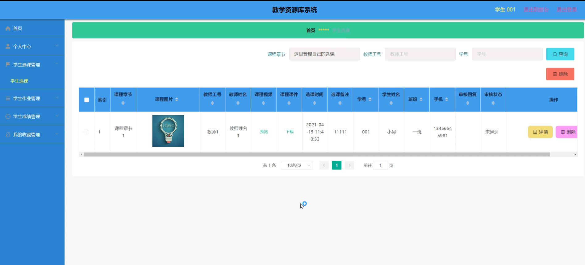
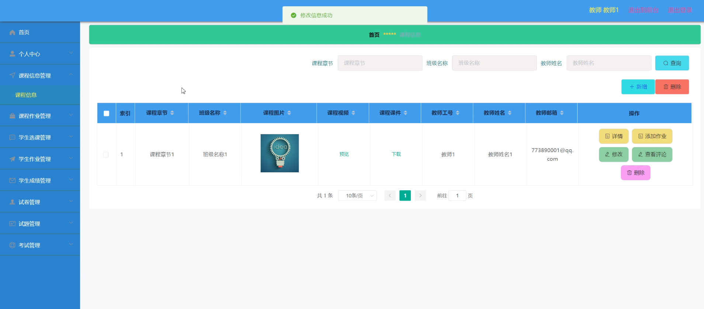

# 基于springboot的教学资源库

#### 介绍

本系统是基于Spring Boot框架开发的教学资源库，旨在为学校、教师及学生提供一个集教、学、管于一体的在线教学平台。通过该平台，管理端可以高效地管理教师、学生、课程及作业等资源，教师端可以方便地发布课程信息、布置作业、管理考试等，而学生端则可以随时随地访问学习资源、完成作业、查看成绩等。系统采用前后端分离的设计模式，支持多终端访问，保证了系统的灵活性和可扩展性。

#### 技术栈

后端技术栈：Springboot+Mysql+Maven

前端技术栈：Vue+Html+Css+Javascript+ElementUI

开发工具：Idea+Vscode+Navicate

#### 系统功能介绍

管理端功能模块  
个人中心：管理员可以查看和修改个人信息、登录日志等。  
教师管理：负责教师的增删改查，包括教师信息的录入、更新和删除。  
学生管理：负责学生的增删改查，包括学生信息的录入、更新和删除。  
课程信息管理：管理课程信息的发布、修改和删除，确保课程数据的准确性。  
课程作业管理：监控作业发布和完成情况，为教师和学生提供作业管理的支持。  
学生选课管理：管理学生的选课信息，确保学生选课的顺利进行。   
学生作业管理：查看学生作业提交情况，提供作业批改和反馈的功能。  
学生成绩管理：录入、查看和导出学生成绩，为教学管理提供数据支持。  
系统管理：配置系统参数、用户权限、日志管理等，保障系统的稳定运行。  

教师端功能模块  
课程作业：发布、查看和批改作业，为学生提供及时的反馈。  
试卷列表：管理试卷的创建、发布和删除，支持在线考试功能。  
公告信息：发布课程通知、公告等，方便与学生沟通。  
个人中心：查看和修改个人信息、登录日志等。  
课程信息管理：管理自己教授的课程信息，包括课程内容的更新和维护。  
课程作业管理：与管理端的功能类似，但仅限于教师自己发布的作业。  
学生选课管理：查看学生选课情况，便于了解学生的学习进度。  
学生作业管理、学生成绩管理、试卷管理、试题管理、考试管理：这些功能使教师能够全面管理学生的学习过程和成绩。  

学生端功能模块  
课程作业：查看作业要求、提交作业并查看批改结果。  
试卷列表：查看并参与在线考试，查看考试成绩。  
公告信息：查看教师发布的课程通知、公告等。  
个人中心：查看和修改个人信息、登录日志等。  
学生选课管理：选择并管理自己的课程，确保选课信息的准确性。  
学生作业管理、学生成绩管理：查看自己的作业完成情况和成绩信息。  
我的收藏管理：收藏重要的课程资料、作业、试卷等，方便日后查阅。  

#### 系统作用

教学资源整合与管理：  
通过集中的方式整合和管理各类教学资源，如课程资料、作业、试卷等，使得这些资源能够被高效地利用和共享。  
管理员可以通过系统轻松地添加、编辑和删除资源，确保资源库的准确性和时效性。  

在线教学支持：
为教师提供在线发布课程信息、布置作业、管理考试等功能，使教学更加便捷和高效。   
学生可以随时随地通过系统访问学习资源，参与在线学习，打破了传统课堂的时空限制。  

作业与考试管理：
教师能够方便地发布作业和试卷，设定提交时间和要求，减少纸质作业的繁琐。  
学生可以通过系统提交作业和试卷，并查看批改结果和成绩，实现及时的反馈和评估。  
管理员和教师还可以对作业和考试数据进行统计和分析，为教学改进提供数据支持。  

学生选课与学习进度管理：  
学生可以根据自己的兴趣和需求选择课程，并通过系统查看选课情况和课程进度。  
教师可以通过系统监控学生的学习进度和作业完成情况，及时给予指导和帮助。  

沟通与互动：  
通过公告信息、通知等功能，教师和学生之间可以实现及时的沟通和互动，促进教学过程的顺利进行。  
学生之间也可以通过系统内的讨论区、留言板等功能进行交流和合作，增强学习体验。

个性化学习支持：   
学生可以根据自己的学习情况和兴趣，定制个性化学习计划，提高学习效率。  
系统还可以根据学生的历史学习数据推荐相关的学习资源和课程，实现智能推荐和个性化服务。  

数据统计与分析：  
系统可以收集和分析各类教学数据，如学生选课情况、作业完成情况、考试成绩等，为教学管理提供数据支持。  
管理员和教师可以通过数据分析结果了解学生的学习状况和教学效果，从而做出针对性的改进措施。  

#### 系统功能截图

代码结构

数据库表

首页

个人中心

课程信息

课程作业

后台管理

学生选课

教师端后台管理

试卷管理

管理员端后台管理

学生成绩管理

公告信息

#### 总结

本教学资源库系统基于Spring Boot框架开发，具备管理端、教师端和学生端三个主要角色。通过详细的功能模块设计，系统在教学资源管理、在线教学、作业管理、考试管理等方面提供了全面而高效的支持。系统的实施不仅提高了教学资源的利用效率，也促进了教学模式的创新和发展。未来，我们将继续完善和优化系统功能，以满足更多用户的需求。

#### 使用说明

创建数据库，执行数据库脚本 修改jdbc数据库连接参数 下载安装maven依赖jar 启动idea中的springboot项目

后台地址：http://localhost:8080/springboot60a0e/admin/dist/index.html

管理员  abo 密码 abo

前台地址：http://localhost:8080/springboot60a0e/front/index.html

